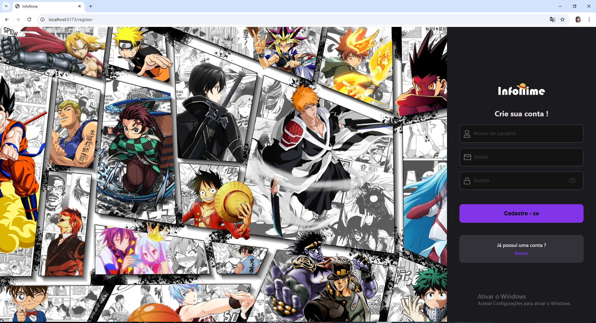
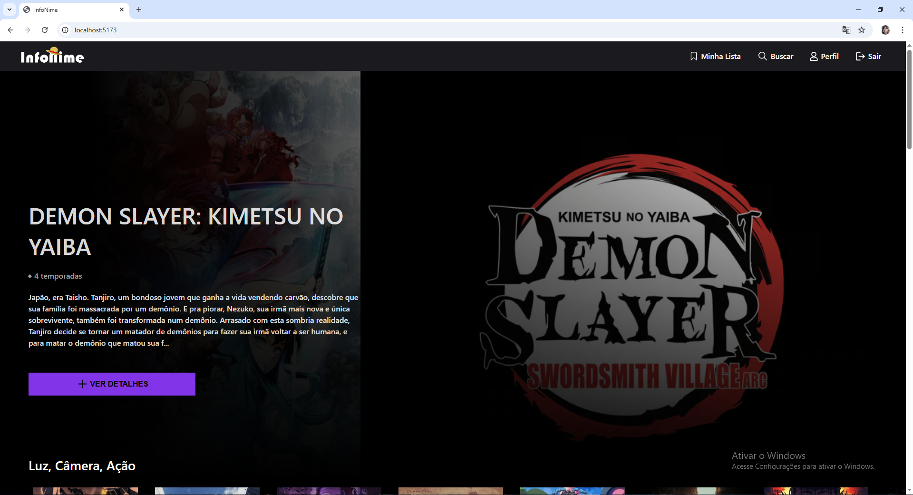
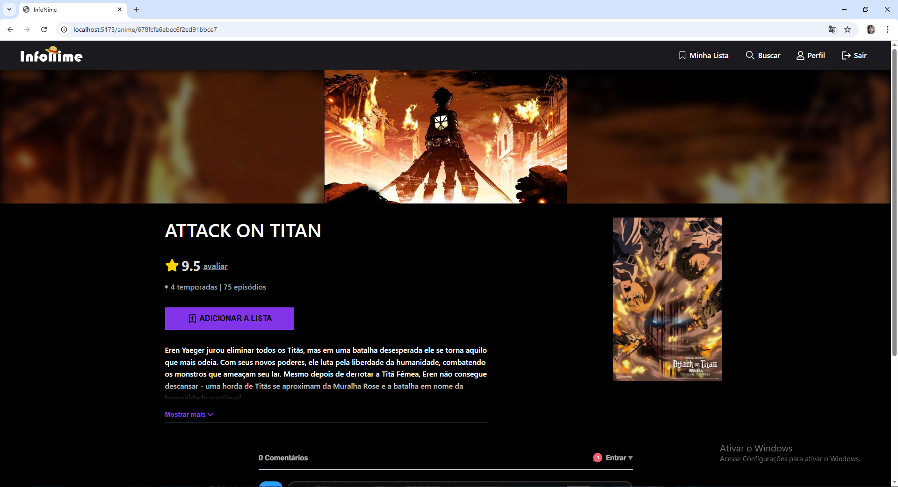
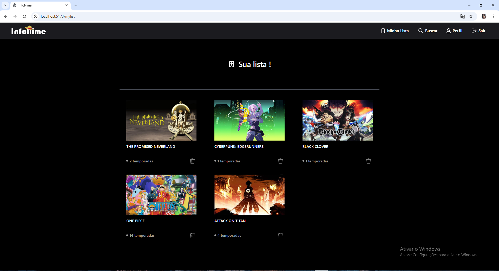
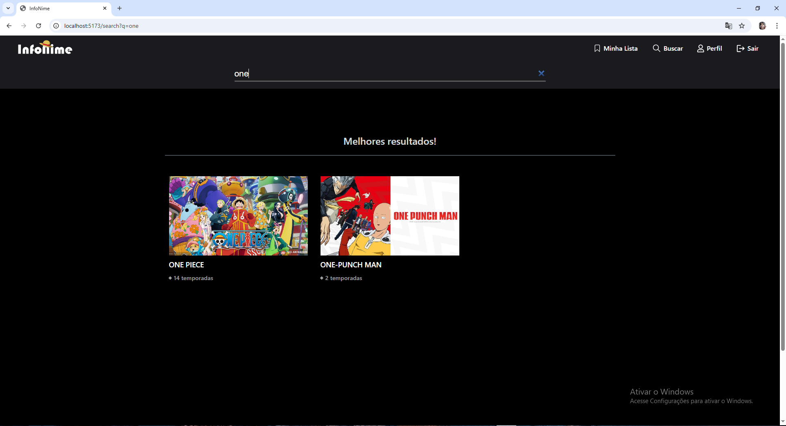
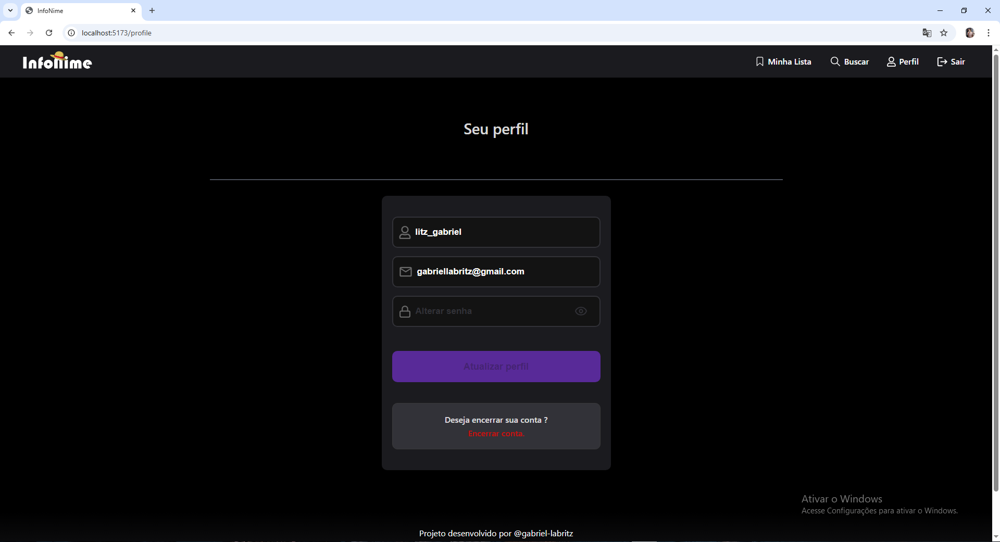
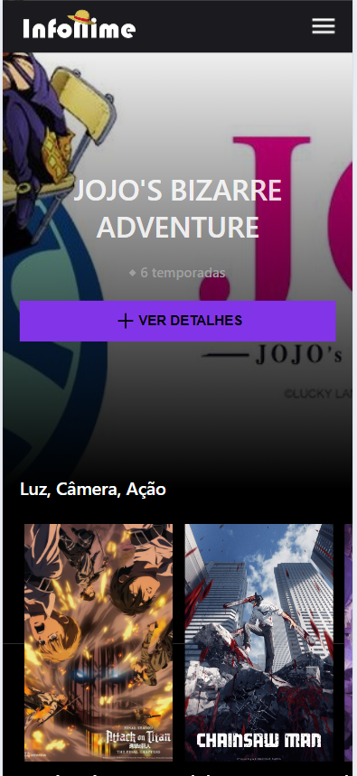

# InfoNime 🎬

Aplicação web desenvolvida com React consumindo o meu próprio backend, permitindo aos usuários explorarem animes, visualizarem informações detalhadas, adicionarem/removerem títulos à sua lista de animes pessoal e interagirem com comentários e avaliações.

## Acesse o projeto 💻
https://infonime-frontend.vercel.app

## Sobre o projeto 🧠

Esse projeto foi desenvolvido com foco em praticar:

- **Estruturação de componentes reutilizáveis**
- **Boas práticas com hooks e contextAPI**
- **Reafatoração e maior legibilidade e clean code**
- **Tratamentos de erros e loading**
- **Integração e requisições ao backend**

## Funcionalidades da aplicação ⚙

- 🔍 **Busca por animes**
- 📂 **Visualização de animes por categoria**
- ⭐ **Avaliação e comentários**
- 📌 **Adicionar/remover animes da lista pessoal**
- 🔒 **Sistema de autenticação (login/registro)**
- ⚙️ **Perfil de usuário editável**
- 🎨 **Interface responsiva**

## Tecnologias 🛠

- [React](https://reactjs.org/)
- [TypeScript](https://www.typescriptlang.org/)
- [ReactRouterDOM](https://reactrouter.com/)
- [Axios](https://axios-http.com/)
- [React Toastify](https://fkhadra.github.io/react-toastify/)
- [ContextAPI](https://reactjs.org/docs/context.html)
- [Vite](https://vitejs.dev/)
- [CSSModules]()
- Backend: **Node.js + Express + JWT + MongoDB (Mongoose) + Multer**

## 📸 Prints da Aplicação

### 🔐 Tela de Registro



### 🏠 Tela da Home



### 📄 Tela do Anime



### 📋 Tela MyList



### 🔍 Tela de Busca



### ⚙ Tela Perfil



### Mobile



## Como rodar o projeto localmente ✔

```bash
## Clone o repositório
git clone https://github.com/Gabriel-Labritz/infonime_frontend_vite.git

## Acesse a pasta
cd infonime_frontend_vite

# Instale as dependências
npm install

# Rode o projeto
npm run dev

```

## Variáveis de ambiente 🛠

```bash
  ### Crie um arquivo .env na raiz do projeto com:
  VITE_baseUrlApi=https://infonime-backend.onrender.com
  VITE_baseUrlImg=https://infonime-backend.onrender.com/public/images/animes/
```

## Autor 🙋‍♂️

Gabriel Labritz - Dev Júnior

- [GitHub](https://github.com/Gabriel-Labritz)
- [LinkedIn](https://www.linkedin.com/in/gabriel-labritz-199499229/)
